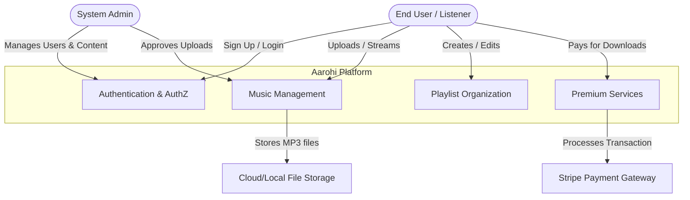
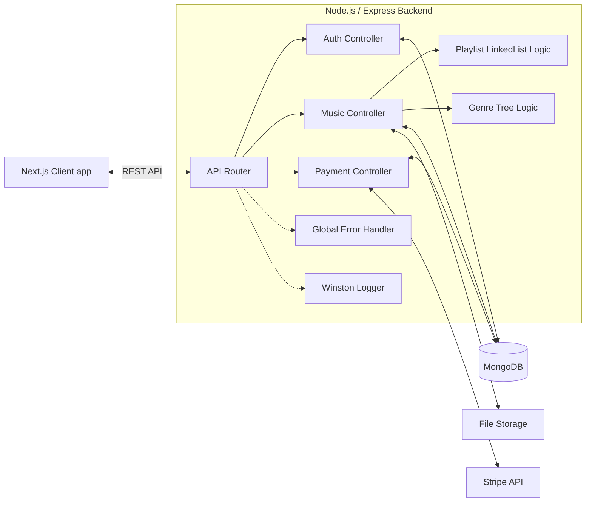
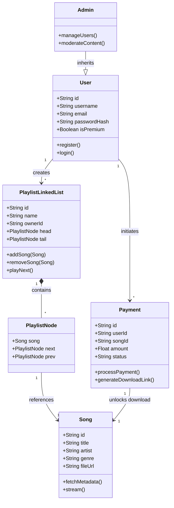
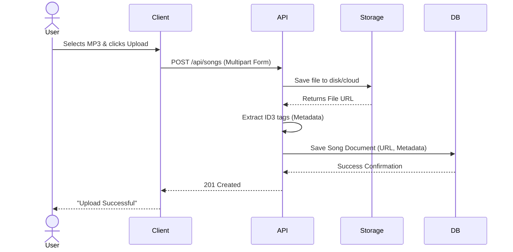
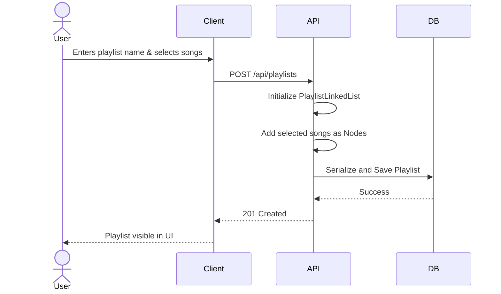
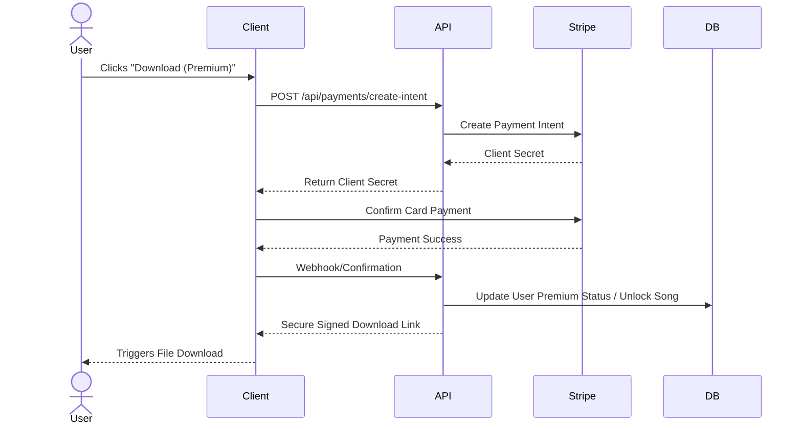
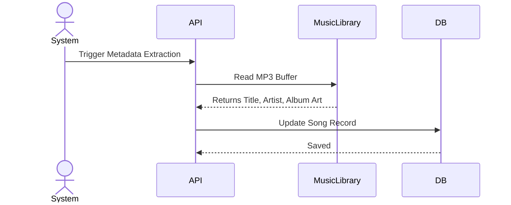
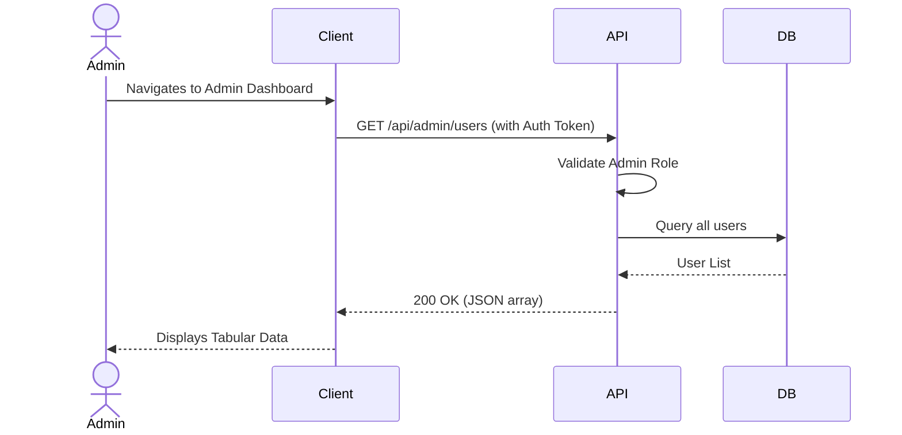
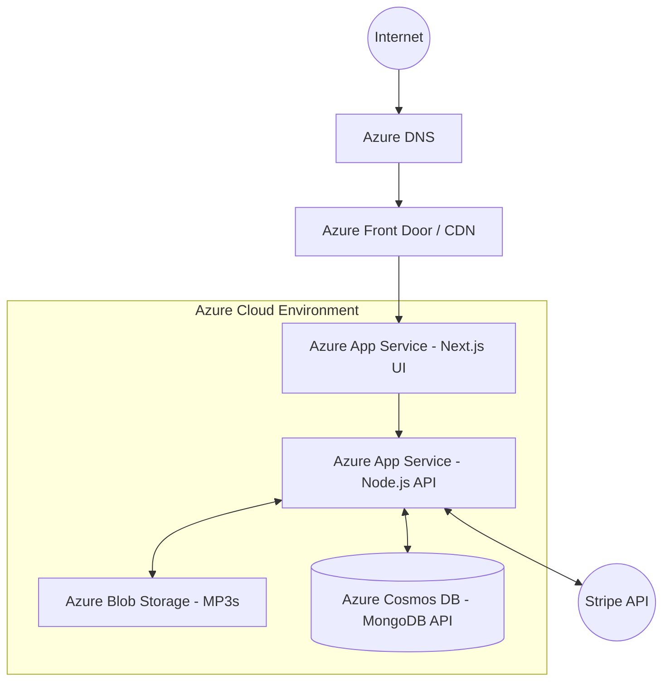

# Aarohi Music Platform - Software Engineering Documentation

## 1. Business Architecture Diagram

The Business Architecture outlines the core processes and entities interacting within the Aarohi Music Platform.



---

## 2. User Stories & Poker Planning Estimates

*Note: Poker Planning uses the Fibonacci sequence (1, 2, 3, 5, 8, 13) to represent complexity and effort.*

| ID | User Story | Acceptance Criteria | Poker Estimate |
|---|---|---|---|
| US-01 | As a user, I want to upload multiple music files so that I can add my own songs to the platform. | 1. Support batch upload of .mp3 files.<br>2. Show progress bar.<br>3. Validate file type and size. | 8 |
| US-02 | As a user, I want to create a playlist so that I can group my favorite songs. | 1. Create playlist with a name.<br>2. Add/remove songs to the playlist. | 5 |
| US-03 | As a user, I want to organize songs by genre or artist so that I can easily find specific types of music. | 1. Filter songs by metadata tags (Artist, Genre).<br>2. Display results in a paginated list. | 3 |
| US-04 | As a user, I want to stream a song online so that I can listen to it before deciding to download. | 1. Integrated audio player.<br>2. Play, pause, skip controls. | 5 |
| US-05 | As a user, I want to download high-quality songs after making a payment so that I can listen offline. | 1. Prevent download without payment.<br>2. Secure download link generated post-payment. | 13 |
| US-06 | As a system, I want to fetch song metadata automatically (if available) so that users don't have to enter it manually. | 1. Extract ID3 tags from uploaded MP3s.<br>2. Populate Title, Artist, Genre automatically. | 5 |
| US-07 | As an admin, I want to view all registered users so that I can manage the platform's community. | 1. Tabular view of users.<br>2. Ability to search by email/username. | 3 |
| US-08 | As an admin, I want to delete inappropriate songs so that the platform remains safe and high-quality. | 1. Admin delete button on any song.<br>2. Confirmation modal before deletion. | 2 |
| US-09 | As a user, I want a dark-themed, sleek UI so that the app feels premium and modern. | 1. Black and Gold color palette.<br>2. Smooth transitions/animations. | 8 |
| US-10 | As a user, I want my playlists to load extremely fast so that I have a seamless experience. | 1. Backend uses efficient Linked Lists/Trees for playlist retrieval.<br>2. Response time < 200ms. | 5 |

---

## 3. Non-Functional Requirements (NFRs)

1. **Performance**: The system must load user playlists in under 200 milliseconds. Audio streaming should begin buffering within 1 second of clicking play, assuming a standard 4G/Broadband connection.
2. **Security**: All payment transactions must be handled securely via Stripe, with no credit card data stored on the Aarohi servers. User passwords must be hashed using bcrypt.
3. **Scalability**: The backend architecture (Node.js/Express) should be stateless to allow horizontal scaling behind a load balancer, supporting at least 1,000 concurrent streaming users.

---

## 4. Architecture Diagram & Design Principles

### Architecture Diagram



### Design Principles and Patterns
* **Architecture Pattern Used**: **Client-Server Architecture with MVC (Model-View-Controller) on the backend**. 
  * *Why*: Separates concerns. Next.js handles the View (Client), Express routes act as Controllers, and Mongoose handles Models. This makes the system modular and easier to maintain.
* **Design Principles Used**:
  * **Single Responsibility Principle (SOLID)**: Each controller (Auth, Music, Payment) handles only its specific domain logic.
  * **Dependency Injection**: Used in testing to mock the database and Stripe API, ensuring isolated and reliable unit tests.
  * **Custom Data Structures**: As per assignment requirements, memory-based operations for complex playlist organization will utilize Linked Lists (for sequential track play) and Trees (for hierarchical genre organization).

---

## 5. Class Diagrams



---

## 6. Sequence Diagrams

### 1. Upload Song (US-01)


### 2. Create Playlist (US-02)


### 3. Purchase Download (US-05)


### 4. Fetch Metadata (US-06)


### 5. Admin Manages Users (US-07)


---

## 7. Test Plans

**Objective**: Ensure the Aarohi platform securely handles music uploads, strictly enforces the payment gate for downloads, and correctly implements the custom data structures for playlist management.

**Scope**:
- **Unit Testing**: Testing the `PlaylistLinkedList` and `GenreTree` logic in isolation.
- **Integration Testing**: Testing API endpoints with a mock MongoDB database.
- **E2E Testing**: Simulating a user uploading a song, creating a playlist, and attempting a mock Stripe payment.

**Tools**: Jest & Supertest (Backend), Cypress (Frontend E2E).

---

## 8. Test Cases

| TC ID | User Story | Scenario | Steps | Expected Result (Happy Path) | Expected Result (Error Scenario) |
|---|---|---|---|---|---|
| TC-01 | US-01 (Upload) | Upload valid MP3 file | 1. Login. 2. Select 5MB .mp3 file. 3. Click Upload. | File uploads successfully, metadata is extracted and saved to DB. | Select a .pdf file instead -> Error: "Invalid file format. Only MP3 allowed." |
| TC-02 | US-02 (Playlist) | Create playlist with songs | 1. Enter name "Chill". 2. Select 2 uploaded songs. 3. Save. | Playlist is created, linked list is formed, visible on dashboard. | Submit empty name -> Error: "Playlist name is required." |
| TC-03 | US-05 (Download) | Purchase and download | 1. Click download on premium song. 2. Complete mock Stripe payment. | Payment succeeds, secure download link is generated and file downloads. | Payment card declined -> Error: "Payment failed. Download locked." |
| TC-04 | US-07 (Admin) | Access admin panel | 1. Login as Admin. 2. Navigate to `/admin`. | Dashboard loads showing user statistics and tables. | Login as normal User -> Error: "403 Forbidden: Admin access required." |
| TC-05 | US-10 (Performance)| Playlist iteration | 1. Load a playlist with 100 songs. 2. Click "Next Track". | Backend `playNext()` linked list method returns the next song in < 20ms. | N/A (Internal logic error would throw 500 server error). |

---

## 9. GitHub Repository Structure

```text
aarohi-music-platform/
│
├── .github/workflows/       # CI/CD Pipelines
├── client/                  # Next.js Frontend
│   ├── public/              # Static assets (images, fonts)
│   ├── src/
│   │   ├── components/      # Reusable React UI components
│   │   ├── pages/           # Next.js routing pages
│   │   ├── styles/          # Tailwind & custom CSS (Black & Gold theme)
│   │   └── utils/           # Helper functions
│   └── package.json
│
├── server/                  # Node.js/Express Backend
│   ├── src/
│   │   ├── controllers/     # Route logic (Auth, Music, Payment)
│   │   ├── models/          # Mongoose DB schemas
│   │   ├── routes/          # Express API endpoints
│   │   ├── structures/      # Custom DS (PlaylistLinkedList.js, GenreTree.js)
│   │   └── index.js         # Entry point
│   ├── tests/               # Jest test files
│   └── package.json
│
├── docs/                    # Architecture diagrams and assignments
├── .gitignore
└── README.md
```

**Naming Conventions**:
- **Folders**: lowercase, kebab-case (e.g., `music-management`).
- **Files (Components/Classes)**: PascalCase (e.g., `PlaylistLinkedList.js`, `SongCard.jsx`).
- **Files (Utils/Routes)**: camelCase (e.g., `authRoutes.js`, `generateToken.js`).

---

## 10. DevOps Architecture & Azure Tools

**DevOps Architecture**:
The project utilizes a continuous integration and continuous deployment (CI/CD) pipeline to automate testing and deployment.

- **Version Control**: GitHub.
- **CI/CD Platform**: GitHub Actions (integrating with Azure).
- **Azure Tools Used**:
  - **Azure App Service**: For hosting the Node.js backend API and the Next.js frontend (or static Web App).
  - **Azure Cosmos DB (MongoDB API)**: Cloud database solution.
  - **Azure Blob Storage**: For securely storing and retrieving uploaded `.mp3` files.
  - **Azure Monitor / Application Insights**: For error logging, tracking response times, and application health.

---

## 11. Deployment Architecture


